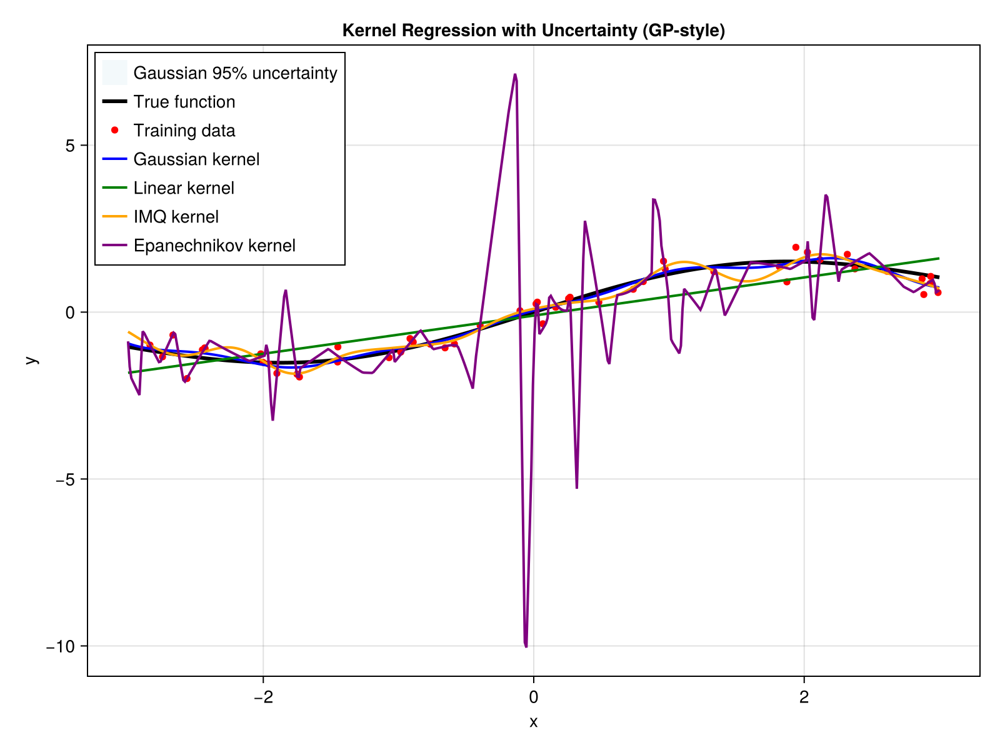

# SimpleKernelRegression

[](https://NilsWildt.github.io/SimpleKernelRegression.jl/stable)
[](https://NilsWildt.github.io/SimpleKernelRegression.jl/dev)
[](https://github.com/NilsWildt/SimpleKernelRegression.jl/actions/workflows/Test.yml?query=branch%3Amain)
[](https://codecov.io/gh/NilsWildt/SimpleKernelRegression.jl)
[](https://github.com/NilsWildt/SimpleKernelRegression.jl/actions/workflows/Docs.yml?query=branch%3Amain)
[](https://github.com/JuliaBesties/BestieTemplate.jl)
[](https://github.com/JuliaTesting/Aqua.jl)
[](https://github.com/fredrikekre/Runic.jl)

A Julia package for kernel regression (regularized kernel interpolation) using various kernel functions. This package implements different kernels that can be used for non-parametric regression and interpolation tasks.



## Overview

SimpleKernelRegression provides a collection of kernel functions and utilities for performing kernel-based regression. The package supports multiple kernel types and provides both simple functional interfaces and optimized struct-based implementations for performance-critical applications.

## Features

- **Multiple Kernel Types**: Gaussian, Linear, Polynomial, Inverse Multiquadratic (IMQ), Multiquadratic (MQ), and Epanechnikov kernels
- **Flexible Interface**: Simple functional API and advanced struct-based API for performance
- **Regularization**: Built-in regularization to handle ill-conditioned problems
- **Derivatives**: Support for kernel derivative computation for selected kernels
- **Optimized Performance**: Uses platform-specific BLAS libraries (AppleAccelerate on Apple Silicon, MKL on Intel)

## Installation

```julia
using Pkg
Pkg.add("SimpleKernelRegression")
```

## Quick Start

```julia
using SimpleKernelRegression
using Random

# Generate sample data
Random.seed!(42)
X_train = rand(20, 2)  # 20 training points in 2D
Y_train = sum(X_train.^2, dims=2) + 0.1 * randn(20, 1)  # Quadratic function with noise

# Create a Gaussian kernel
kernel = Gaussian(1.0)

# Get interpolant function
f = get_kernel_interpolant(X_train, Y_train, kernel, 1e-6)

# Make predictions
X_test = rand(10, 2)
Y_pred = f(X_test)
```

## Available Kernels

### Gaussian Kernel
```julia
kernel = Gaussian(σ)  # σ is the bandwidth parameter
```
Implements: `K(x,y) = exp(-||x-y||²/(2σ²))`

### Linear Kernel
```julia
kernel = Linear(calc_bias)  # calc_bias determines if bias term is included
```
Implements: `K(x,y) = ⟨x,y⟩` (or `⟨[1;x],[1;y]⟩` with bias)

### Polynomial Kernel
```julia
kernel = Polynomial(a, p)  # a is additive constant, p is degree
```
Implements: `K(x,y) = (⟨x,y⟩ + a)^p`

### Inverse Multiquadratic (IMQ) Kernel
```julia
kernel = Imq(σ)  # σ is the scaling parameter
```
Implements: `K(x,y) = (1 + ||x-y||²/σ²)^(-1/2)`

### Multiquadratic (MQ) Kernel
```julia
kernel = Mq(σ)  # σ is the scaling parameter
```
Implements: `K(x,y) = (1 + σ²||x-y||²)^(1/2)`

### Epanechnikov Kernel
```julia
kernel = Epanechnikov(σ)  # σ is the scaling parameter
```
Implements a local kernel with compact support.

## Advanced Usage

### Optimized Interpolants
For repeated predictions with the same kernel and training data but different target values:

```julia
# Create a reusable interpolant structure
interp = KernelInterpolant(X_train, kernel, 1e-6)

# Update with new target values
update_coefficients!(interp, Y_train)

# Make predictions
Y_pred = interp(X_test)
```

### Kernel Derivatives
For kernels that support derivative computation:

```julia
# Get derivative interpolant
f_deriv = get_kernel_derivative_interpolant(X_train, Y_train, gaussian_kernel, 1e-6)

# Compute derivatives at test points
dY_pred = f_deriv(X_test)
```

## Example: Comparing Different Kernels

See `scripts/example.jl` for a complete example that compares different kernel types on a linear regression problem.

```julia
julia> include("scripts/example.jl")
Plot saved as 'kernel_regression_example.png'
Mean Squared Error (Gaussian): 0.163
Mean Squared Error (Linear): 1.010
Mean Squared Error (IMQ): 0.396
```

## Mathematical Background

This package implements regularized kernel interpolation, which solves:

```
f(x) = Σᵢ αᵢ K(x, xᵢ)
```

where the coefficients α are found by solving:
```
(K + λI)α = y
```

with K being the kernel matrix, λ the regularization parameter, and y the target values.

## Performance Notes

- The package automatically selects optimized BLAS libraries based on your system
- For large datasets, consider using the struct-based `KernelInterpolant` interface
- Regularization parameter should be chosen based on noise level and desired smoothness

## Contributing

Contributions are welcome! Please see the documentation for development guidelines.

## License

This project is licensed under the MIT License.
