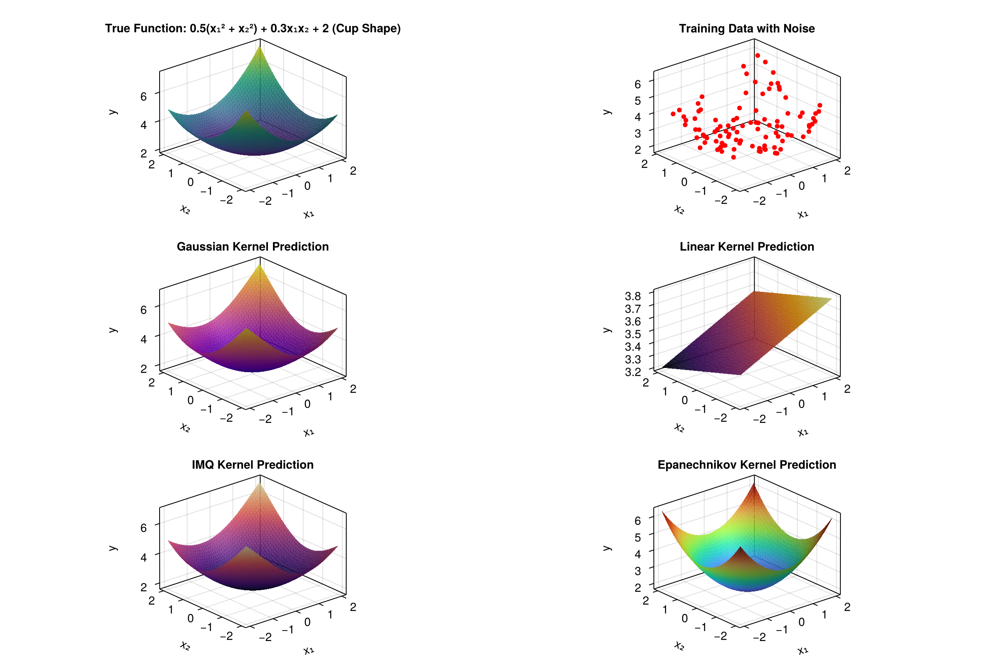

```@meta
CurrentModule = SimpleKernelRegression
```

# SimpleKernelRegression.jl



## Overview

SimpleKernelRegression is just my own simple kernel regression. Doesn't do more, doesn't do less. 

## Installation

```julia
using Pkg
Pkg.add("SimpleKernelRegression")
```

## Quick Start

```julia
using SimpleKernelRegression
using Random

# Generate sample data
Random.seed!(42)
X_train = rand(20, 2)  # 20 training points in 2D
Y_train = sum(X_train.^2, dims=2) + 0.1 * randn(20, 1)  # Quadratic function with noise

# Create a Gaussian kernel
kernel = Gaussian(1.0)

# Get interpolant function
f = get_kernel_interpolant(X_train, Y_train, kernel, 1e-6)

# Make predictions
X_test = rand(10, 2)
Y_pred = f(X_test)
```

## Available Kernels

### Gaussian Kernel
```julia
kernel = Gaussian(σ)  # σ is the bandwidth parameter
```
Implements: `K(x,y) = exp(-||x-y||²/(2σ²))`

### Linear Kernel
```julia
kernel = Linear(calc_bias)  # calc_bias determines if bias term is included
```
Implements: `K(x,y) = ⟨x,y⟩` (or `⟨[1;x],[1;y]⟩` with bias)

### Polynomial Kernel
```julia
kernel = Polynomial(a, p)  # a is additive constant, p is degree
```
Implements: `K(x,y) = (⟨x,y⟩ + a)^p`

### Inverse Multiquadratic (IMQ) Kernel
```julia
kernel = Imq(σ)  # σ is the scaling parameter
```
Implements: `K(x,y) = (1 + ||x-y||²/σ²)^(-1/2)`

### Multiquadratic (MQ) Kernel
```julia
kernel = Mq(σ)  # σ is the scaling parameter
```
Implements: `K(x,y) = (1 + σ²||x-y||²)^(1/2)`

### Epanechnikov Kernel
```julia
kernel = Epanechnikov(σ)  # σ is the scaling parameter
```
Implements a local kernel with compact support.

## Advanced Usage

### Optimized Interpolants
For repeated predictions with the same kernel and training data but different target values:

```julia
# Create a reusable interpolant structure
interp = KernelInterpolant(X_train, kernel, 1e-6)

# Update with new target values
update_coefficients!(interp, Y_train)

# Make predictions
Y_pred = interp(X_test)
```

### Kernel Derivatives
For kernels that support derivative computation:

```julia
# Get derivative interpolant
f_deriv = get_kernel_derivative_interpolant(X_train, Y_train, gaussian_kernel, 1e-6)

# Compute derivatives at test points
dY_pred = f_deriv(X_test)
```

